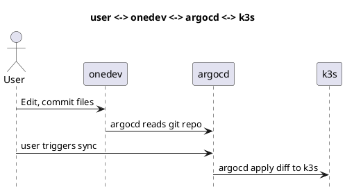

# Argo CD

This document describes how to set up a lightweight Kubernetes cluster using k3s and deploy Argo CD for GitOps-based 
application management.

## Requirements

Hardware/network/so requirements

- Minimum 4GB RAM
- Minimum 2 CPU cores
- Minimum 20GB disk (ubuntu + k3s + container images)
- Internet access to download container images
- Ubuntu 24.04 LTS

---

## Quick start

Script automation instructions (vm or baremetal)

run the following commands as root inside the machine or vm to deploy the working setup:

```bash
git clone https://github.com/uaiso-serious/infra.git
./infra/_setup/k3s/k3s.sh
./infra/_setup/argocd/argocd.sh
```

Takes about 10 minutes to download container images depending on your internet speed. You can use
kubectl or k9s command to check the pod status.

Configure your browser to use a http proxy to access the ingress routes, point it to &lt;your-k3s-ipv4&gt; port 3128.

Easy proxy stuff with [FoxyProxy for Chrome](https://chromewebstore.google.com/search/foxyproxy)
or [FoxyProxy for Firefox](https://addons.mozilla.org/en-US/firefox/addon/foxyproxy-standard/)

Open [http://argocd.uaiso.lan/](http://argocd.uaiso.lan/) login as admin/Admin123

Enable/Delete applications as needed.

Congratulations, you have a k3s cluster with gitops.

---

The git repository for argocd is:

[http://onedev.uaiso.lan](http://onedev.uaiso.lan)

admin / admin

---

## Integration

The architecture looks like this:

User <-> Onedev <-> ArgoCD <-> K3s


